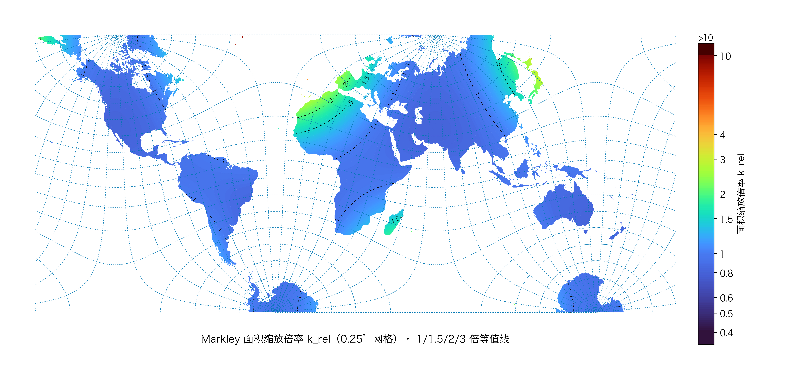

# 马克利 四面体投影 地图 / Markley Tetrahedral Map

> 用 Markley 四面体投影绘制的世界地图，附面积缩放统计数据与热力图。
> 本项目为**纯技术演示与科普**，供地图投影数学原理的学习与交流。

## 目录 Contents

- [投影简介 Introduction](#投影简介-introduction)
- [地图 Maps](#地图-maps)
- [面积缩放倍率统计表 Tables](#面积缩放倍率统计表-tables)
- [热力图 Heatmap](#热力图-heatmap)
- [图片来源与授权 Attribution](#图片来源与授权-attribution)
- [免责声明 Disclaimer](#免责声明-disclaimer)
- [许可证 License](#许可证-license)
- [参考资料 References](#参考资料-references)
- 详细文档：[投影数学与历史](docs/introduction.md) · [统计表格](docs/data-tables.md) · [来源与授权](ATTRIBUTION.md)

## 投影简介 Introduction

Markley 四面体投影（Markley's Tetrahedral Map）由 F. Landis Markley 于 **1982 年**提出，是一种**等角**（Conformal）世界地图投影，基于 L.P. Lee 1965 年的等角四面体投影改进而来。

其核心设计理念是“**大陆优先**”：通过精妙的数学排列，将投影产生的极端变形“驱逐”到远离大陆的海洋区域，从而在矩形图幅内尽可能保持大陆轮廓的自然形状。代价是海洋被严重拉伸，因此**不适合面积精确测量与航海导航**。

详见 [投影数学与历史](docs/introduction.md)。

## 地图 Maps

### 中文版 Chinese

### 英文版 English

### 密铺图 Tessellation

## 面积缩放倍率统计表 Tables

全部统计数据已转录为 Markdown 表格（共 4 张），便于检索与引用：

| 统计表 | 条目数 |
| :-- | :-- |
| 各国统计 | 197 项 |
| 中国省份统计 | 34 项（含合计） |
| 倍率区间统计 | 6 个区间 |
| 各大洲统计 | 7 大洲 + 合计 |

➡️ **[查看完整统计表 → docs/data-tables.md](docs/data-tables.md)**

> 说明：原统计图（5 张 JPG）数据量大、不便检索，已全部转录为 Markdown 文本并删除原图。

## 热力图 Heatmap

## 图片来源与授权 Attribution

- 本项目所用图片由 B 站 UP 主 [@半调](https://space.bilibili.com/3493295535688604) 授权使用。
- 原视频：[全网首张｜真实还原地球的世界地图（马克利投影）](https://www.bilibili.com/video/BV1ochJ6wERK/)
- 图片版权归原作者所有，不适用本项目的开源许可。未经原作者许可，请勿二次转载或商用。
- 更多详情请见 [ATTRIBUTION.md](ATTRIBUTION.md)。

## 免责声明 Disclaimer

以下为**原作者绘制说明**（原文转载，完整保留，本图中文字已由原 `disclaimer.png` 转录为文本）：

> 本地图为本人原创绘制，仅供个人学习、研究及非商业分享。禁止商用、售卖及二次商用。非商业转载请联系保留作者信息及原始出处。
>
> 本图为马克利四面体等角投影科普专题示意图，非严格等面积投影，图上面积大小仅供视觉参考。图中边界仅作示意，不作为勘界、确权的法定依据，不代表对任何地区主权归属的认定；领土主权请以中国官方认定为准。非专业制图，如有错误遗漏可以友好提出，本图与政治正确无关，本人无任何政治立场，仅凭兴趣绘制，仅图一乐。
>
> 另外列有几张面积放大倍率详细数据，由于统计口径差异，及相关计算误差，仅供参考。

本项目补充说明：

- 本项目仅供地图投影数学原理的学习与交流，不用于商业用途。
- 地图图片不代表任何政治立场，不构成官方标准地图。
- 中国国界以中国官方发布的标准地图为准。
- 如涉及版权或内容问题，请联系删除。

## 许可证 License

- 本项目**文字文档**采用 [CC-BY-4.0](https://creativecommons.org/licenses/by/4.0/) 许可。
- **图片版权归原作者所有**，仅经授权展示，不适用上述许可。

## 参考资料 References

- [map-projections.net — Markley Tetrahedral](https://map-projections.net/single-view/markley-tetrahedral:tissot-30-stf)
- [自然资源部标准地图服务系统](http://bzdt.ch.mnr.gov.cn) · [天地图](https://www.tianditu.gov.cn)
